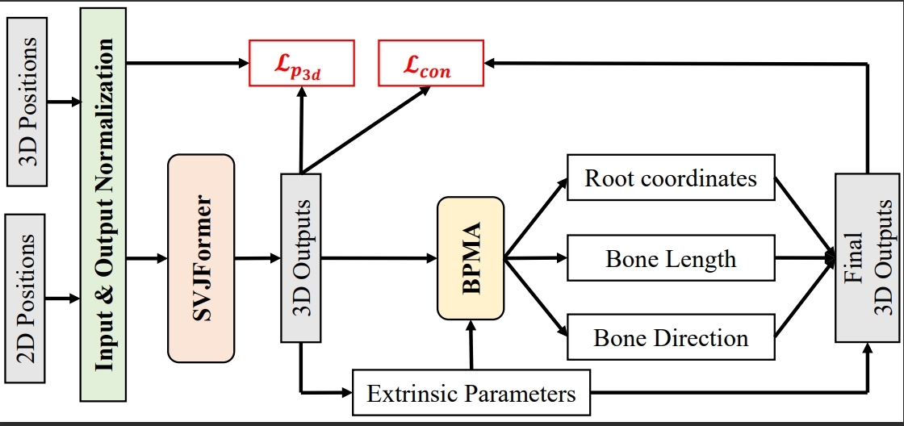
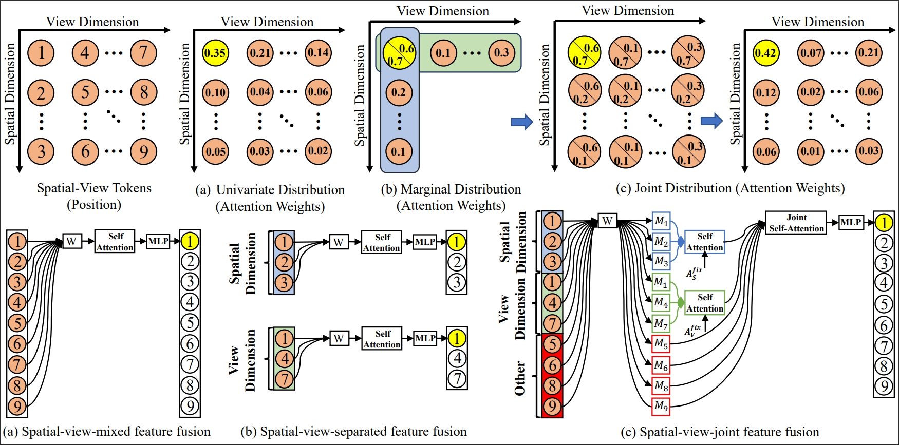

# EFMP: Extrinsic Parameters-free Multi-view 3D human pose estimation

This repository is the official implementation of [EFMP: Extrinsic Parameters-free Multi-view 3D human pose estimation]. 

## Key Idea: Data pre-processing + SVJFormer + BPMA

     
    Framework

     
    SVJFormer

